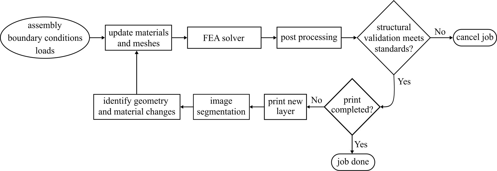
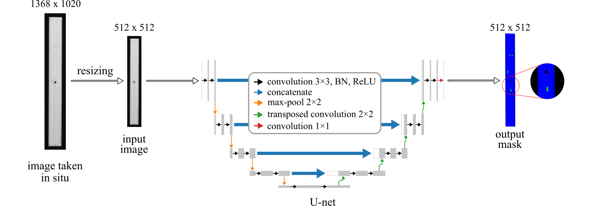
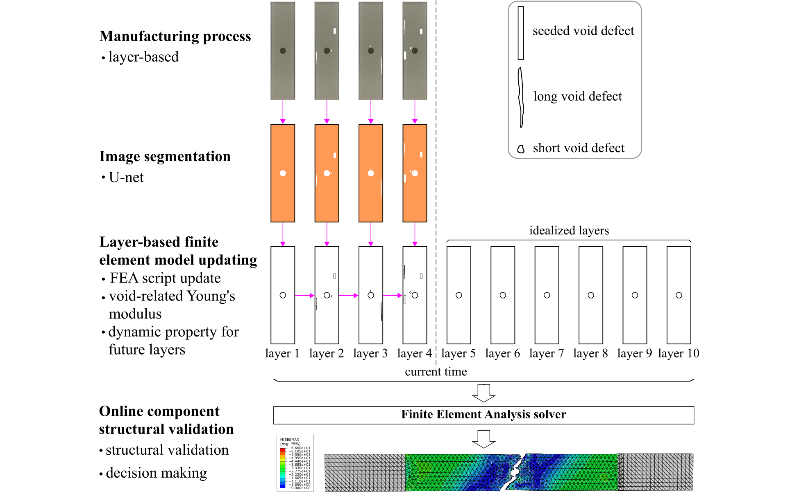

# Simulation-in-the-loop Additive Manufacturing for Real-time Structural Validation

This repo accompanies a paper submitted to Additive Manufacturing 2024 and contains a reproduction of the methodology demonstrated in that paper.

The framework of simulation-in-the-loop real-time FEA product structural quality validation system.

The defect segmentation process with U-net.

The process of real-time automatic FEA structural quality validation on the fourth layer.

## Licensing and Citation

[![CC BY-SA 4.0][cc-by-sa-shield]][cc-by-sa]

This work is licensed under a
[Creative Commons Attribution-ShareAlike 4.0 International License][cc-by-sa].

[cc-by-sa]: http://creativecommons.org/licenses/by-sa/4.0/
[cc-by-sa-image]: https://licensebuttons.net/l/by-sa/4.0/88x31.png
[cc-by-sa-shield]: https://img.shields.io/badge/License-CC%20BY--SA%204.0-lightgrey.svg

Cite as:

@Misc{Fu_2024_SimulationintheLoop,   
  author = {Yanzhou Fu and Austin R.J. Downey},   
  howpublished = {GitHub},  
  title  = {Simulation-in-the-loop-Additive-Manufacturing},   
  year   = {2024},  
  groups = {{ARTS-L}ab},    
  url    = {https://github.com/ARTS-Laboratory/Simulation-in-the-loop-Additive-Manufacturing},    
}
